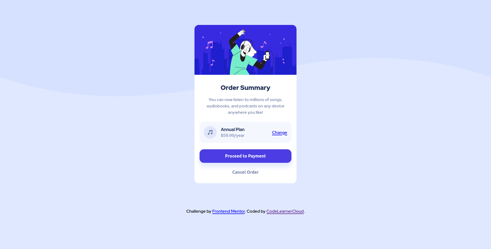

# Frontend Mentor - Order summary card solution

This is a solution to the [Order summary card challenge on Frontend Mentor](https://www.frontendmentor.io/challenges/order-summary-component-QlPmajDUj). 

## Table of contents

- [Overview](#overview)
  - [Screenshot](#screenshot)
  - [Links](#links)
- [My process](#my-process)
  - [Built with](#built-with)
- [Author](#author)

## Overview

### Screenshot

### Links

- Solution URL: [Github Repositories](https://github.com/CodeLearnerCloud/Order-summary-card)
- Live Site URL: [Netlify](https://ecstatic-liskov-ad5c44.netlify.app/)

## My process

### Built with

- Semantic HTML5 markup
- CSS custom properties
- Flexbox

## Author

- Website - [CodeLearnerCloud](https://github.com/CodeLearnerCloud)
- Frontend Mentor - [@CodeLearnerCloud](https://www.frontendmentor.io/profile/CodeLearnerCloud)

